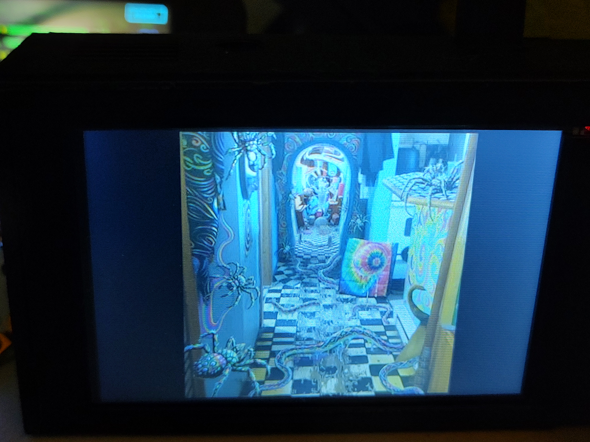
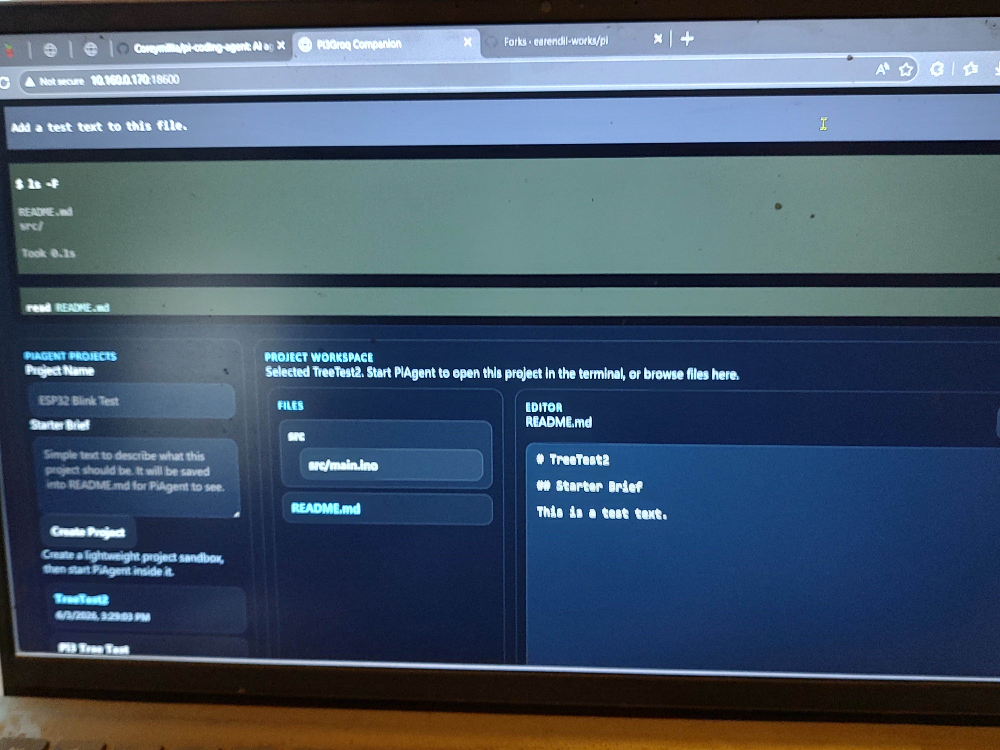

# Pi Coding Agent

Pi Coding Agent is the forked Pi browser UI coding-agent project that grew out of the original Pi3Groq companion work.

It now stands on its own as a **Pi-hosted coding workspace** with:

- a local PiAgent browser terminal
- lightweight project sandboxes with tree browsing and file editing
- a local browser UI for running the Pi coding-agent workflow
- local dev-tool status for PlatformIO plus desktop/browser VS Code detection
- optional Whisplay companion polling when you want to pair it with a Whisplay device

This project is no longer meant to be pushed back into the larger Whisplay repo as its main home. Whisplay support is still optional, but the Pi coding-agent flow is now the primary purpose.

## Core idea

- Raspberry Pi acts as a **keyboard-first coding agent station**
- local browser UI provides a project workspace + PiAgent terminal
- optional Whisplay companion mode still talks to Whisplay over HTTP using:
  - `GET /api/state`
  - `POST /api/input/text`
- the Pi also serves a local `/hdmi` touch-display page for in-progress local display work

## Photos





## Known bugs

- touch screen support is not confirmed working yet
- Whisplay mirror mode is currently unreliable and may not work at all while polling
- the browser UI and optional Whisplay polling are the currently supported paths

## Current wiring target

- SCK: `GPIO11`
- MOSI: `GPIO10`
- CS: `GPIO8`
- DC: `GPIO24`
- RESET: `GPIO25`

The first software pass is browser-first so the local companion flow can be tested before the SPI TFT rendering layer is added.

## Current touch display target

- 3.5-inch portrait display
- `320 x 480`
- XPT2046 touch controller
- Pi3Groq `/hdmi` is the intended local touch-display page for this screen
- tested/default TFT path uses the LCDWiki-style `tft35a` overlay generated from `scripts/tft35a-overlay.dts`
  - ILI9486 panel with the board-specific init sequence
  - `reset=GPIO25`
  - `dc=GPIO24`
  - `pendown=GPIO17`
  - `regwidth=16`
  - `rotate=270`
  - `speed=16000000`

## Current app layout

- `app.py` - small local web server for companion mode
- `web/` - Pi3Groq browser UI and HDMI mirror page
- `data/settings.json` - saved local Pi3Groq settings
- `scripts/launch-hdmi-kiosk.sh` - local HDMI kiosk launcher

## Local run

```bash
cd Pi3Groq
python3 -m pip install --user -r requirements.txt
python3 app.py
```

Default URL:

```text
http://127.0.0.1:18600
```

## Saved settings

Pi3Groq currently saves:

- `mode` - reserved for future companion vs standalone support
- `companionBaseUrl` - Whisplay base URL, for example `http://10.160.0.136:17880`
- `pollIntervalMs` - browser polling interval
- `touchDisplayMode` - `mirror` or `slideshow-chat` for the touch screen
- `slideshowEnabled` - whether idle AI slideshow mode runs on the touch display
- `slideshowIntervalSec` - touch-display AI slide interval
- `chatReturnTimeoutSec` - how long the touch display stays on chat text before returning to the slideshow

## PiAgent browser terminal

Pi3Groq can also host a local PiAgent terminal without changing PiAgent itself.

- install PiAgent on the Pi companion in `~/.local/bin/pi-agent`
- open the normal Pi3Groq browser UI
- use the **PiAgent Browser Terminal** panel to start PiAgent locally
- complete `/login`, provider selection, model selection, and chat inside that terminal

The Pi3Groq web server keeps PiAgent separate from Whisplay companion mode:

- HTTP UI stays on `http://127.0.0.1:18600`
- PiAgent terminal streaming uses a local websocket bridge on `ws://127.0.0.1:18601`
- PiAgent project sandboxes live under `Pi3Groq/data/pi-agent-projects/`

The browser UI now also supports lightweight PiAgent project workspaces:

- create/select a PiAgent project sandbox
- upload an existing project ZIP into a new PiAgent sandbox
- browse a recursive project tree
- open files in the browser
- save file edits back into the selected project
- download a finished PiAgent project as a ZIP archive
- start PiAgent inside the selected project root without changing PiAgent itself

The main browser page also includes a **Local Dev Tools** panel:

- confirms whether `pio` is installed on the Pi
- confirms whether desktop `code` is actually on `PATH`
- explains why `code` launched from SSH may do nothing when there is no desktop display session
- detects a browser IDE such as `code-server` or `openvscode-server` and exposes the default browser URL

Pi3Groq now also exposes a dedicated **VS Code Mode** at:

```text
http://127.0.0.1:18600/vscode
```

That route is meant to open in a **new browser window** and redirect to the detected browser IDE, leaving the normal Pi3Groq PiAgent page unchanged.

Inside the VS Code terminal, use:

```bash
bash scripts/pi-agent-vscode.sh
```

That opens PiAgent's session picker (`--resume`) with the correct local PATH for the Pi. You can also pass normal PiAgent arguments through it, for example:

```bash
bash scripts/pi-agent-vscode.sh --continue
```

For PlatformIO on the Pi, use:

```bash
cd Pi3Groq
bash scripts/install-platformio.sh
```

For a VS Code-style workflow on the Pi, a **browser IDE is the practical path**. Pi3Groq can use `code-server`, `OpenVSCode Server`, or local `code serve-web` when that VS Code build supports it. Use that browser IDE for the file tree and integrated terminal, then run `pi-agent` and `pio` from inside the terminal there.

The `/hdmi` touch-display page can also mirror PiAgent chat activity:

- if Whisplay companion mode is active, PiAgent output can interrupt the slideshow like normal chat activity
- if no Whisplay URL is configured, the touch display falls back to PiAgent-first chat mode instead of showing the AI slideshow
- a keyboard attached to the Pi can type into the touch-display chat field and send text straight to PiAgent without opening the full browser workspace

By default, Pi3Groq now **auto-starts PiAgent on boot**:

- the latest PiAgent project is used automatically
- if no PiAgent project exists yet, Pi3Groq creates a default `PiAgent Workspace`
- disable this with `PI3GROQ_PI_AGENT_AUTOSTART=false`

Environment overrides:

- `PI3GROQ_PI_AGENT_BIN` - alternate PiAgent executable path
- `PI3GROQ_PI_AGENT_WS_PORT` - alternate websocket bridge port
- `PI3GROQ_BROWSER_IDE_PORT` - override the browser IDE port used by `/vscode`
- `PI3GROQ_BROWSER_IDE_PATH` - override the browser IDE path used by `/vscode`

## Touch display / HDMI page

Run the local server, then launch the touch-display page in Chromium:

```bash
cd Pi3Groq
bash scripts/launch-hdmi-kiosk.sh
```

By default it opens:

```text
http://127.0.0.1:18600/hdmi
```

Behavior:

- `mirror` mode keeps the full live status / emoji / text / image mirror on the TFT
- `slideshow-chat` mode shows fullscreen AI gallery slides while idle, then switches to chat text while Whisplay is active
- the return from chat text back to the slideshow is set in the browser UI with `chatReturnTimeoutSec`
- touch-friendly `Prev`, `Refresh`, and `Next` controls appear on the TFT while the slideshow is active
- the TFT slideshow and mirrored image views now use a Pi-side `320x480` composed frame so square Whisplay images are pre-fit for the portrait panel instead of leaving that sizing to browser CSS alone

## SPI TFT kiosk install

To install the physical 320x480 TFT path on a Pi:

```bash
cd Pi3Groq
bash scripts/install-touch-kiosk.sh
sudo reboot
```

To try a different TFT controller profile without editing the script:

```bash
PI3GROQ_TFT_PROFILE=hx8357d bash scripts/install-touch-kiosk.sh
sudo reboot
```

Useful alternatives for 3.5-inch SPI panels on this Pi image:

- `tft35a`
- `ili9486`
- `tontec35_9486`
- `hx8357d`

This installs:

- Chromium kiosk dependencies
- an Xorg fbdev config for the SPI framebuffer
- a `pi3groq-hdmi.service` kiosk service
- persistent `/boot/firmware/config.txt` overlays for:
  - the TFT panel on `spi0-0`
  - the XPT2046 touch controller on `spi0-1`

## Near-term follow-up

- add keyboard handling tuned for the Pi companion hardware
- keep browser UI available even after the TFT path is added
- later add the dual-mode setup path:
  - companion mode by saved Whisplay URL
  - standalone mode by local API keys
